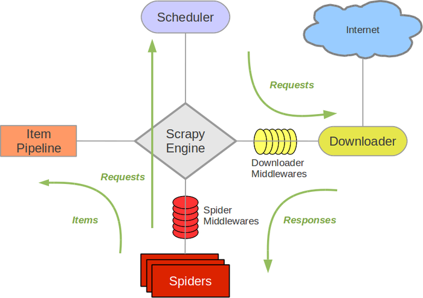

Scrapy
===

## scrapy 安装的步骤

1. pip install scrapy（如果成功了就不必执行下面的命令了）
2. pip install wheel
3. 到网站找Twisted包： http://www.lfd.uci.edu/~gohlke/pythonlibs/
4. 安装下载的那个包：pip install E:\12期\课上代码\Day6\twsted_pakage\Twisted-18.7.0-cp35-cp35m-win_amd64.
   whl
5. 最后再去安装 pip install scrapy
---

## 创建scrapy的爬虫的命令

1. scrapy startproject Tuesday

2. cd Tuesday
例子：
3. scrapy genspider jobbole jobbole.com

---
1. 需要有的那个url和它所对应的函数， 对应到scrapy中就是spiders文件内需要写的内容
2. 需要有存储数据的函数，代码，比如需要存入mysql， 这样的对于需要存储的数据的代码就应该写在Item Pipeline
3. 我们生成的url和对应函数需要有一个队列进行存储并且后续去下载，这个功能在scrapy中就对应着Scheduler
4. 我们需要有一个功能去下载url所对应的response，这个功能对应到scrapy中就是Downloader

爬虫的五个步骤:

1. 需求
2. 找到需要的URL
3. 下载url对应的信息(Downloader)
4. 解析这些信息, 获取特定的信息(spiders)
5. 存储这些信息(ItemPipeline)

特殊的是, schedule.

因为是分布式, 我们之前也讲过, 会用到一个队列存储待处理的URL. 所以Schedule就是: 队列的管理器

---
### 架构数据流程：

1. spiders 需要有初始的 start_url 或者是 函数 start_requests, 会在内部生成Request给到Engine

2. Engine会将初始的Request发送给Scheduler， Engine也会从scheduler中获取request以便交给downloader下载。

3. Engine就得到了Request

4. Engine会将Request发送给downloader下载，在这个过程中，会经过Downloader Middlewares（会经过函数，process_request）

5. downloader 就会去下载页面， 下载结束后会生成一个response，这个response会返回给engine，然后这个过程中会经过 Downloader Middlewares。（会经过process response），这个过程中，有可能会出错，会走的函数叫做（process_exception）

6. Engine 从downloader获取到response之后，就会将这个response返回给spiders，spiders会继续处理它。这个过程中， response会经过spider middlewares,(process_spider_input)

7. spiders 处理这个response，会有两种返回方式，第一种返回Request，第二种返回的是item。这两样返回都会给到 engine，这个过程中就会经过spider middlewares（这个函数就叫process_spider_output）

8. engine 会根据返回的类型做操作， 如果是item，就将这个类发送到Item Pipeline 中。如果是Request，继续发送到sheduler中。继续爬虫。

9. 重复第一步的内容，直到没有任何需要爬取的数据。

