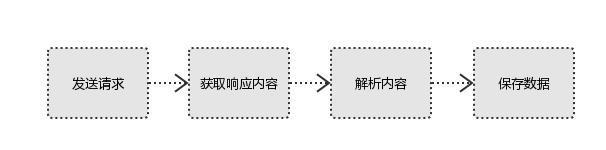
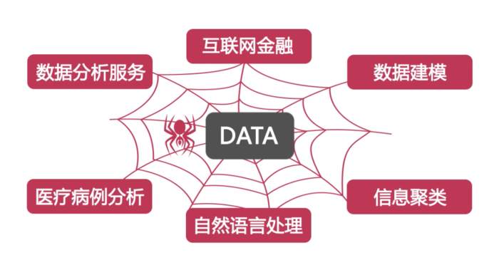

爬虫
===

网络爬虫（又被称为网页蜘蛛，网络机器人，在FOAF社区中间，更经常的称为网页追逐者），是一种按照一定的规则，自动地抓取万维网信息的程序或者脚本。另外一些不常使用的名字还有蚂蚁、自动索引、模拟程序或者蠕虫。

---

1.爬虫五大步骤：
	（1）确定需求，确定自己想要的数据
	（2）找到哪些网站有想要的数据
	（3）将其下载下来（json/txt/html..），通过相应的URL接口去请求（requests）
	（4）通过 re/xpath 等方法，筛选出想要的数据
	（5）将获取的数据存入到MySQL数据库中

