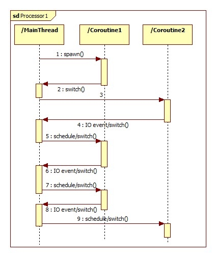

---

Gevent
===

Gevent是一种基于协程的Python网络库，它用到Greenlet提供的，封装了libevent事件循环的高层同步API。它让开发者在不改变编程习惯的同时，用同步的方式写异步I/O的代码。

使用Gevent的性能确实要比用传统的线程高，甚至高很多。但这里不得不说它的一个坑：

* Monkey-patching，我们都叫猴子补丁，因为如果使用了这个补丁，Gevent直接修改标准库里面大部分的阻塞式系统调用，包括socket、ssl、threading和 select等模块，而变为协作式运行。但是我们无法保证你在复杂的生产环境中有哪些地方使用这些标准库会由于打了补丁而出现奇怪的问题

* 第三方库支持。得确保项目中用到其他用到的网络库也必须使用纯Python或者明确说明支持Gevent

---

既然Gevent用的是Greenlet，我们通过下图来理解greenlet:



每个协程都有一个parent,最顶层的协程就是man thread或者是当前的线程，每个协程遇到IO的时候就把控制权交给最顶层的协程，它会看那个协程的IO event已经完成，就将控制权给它。

---
## 下面是gevent的例子：

```python
import gevent

def func1():
    print("func1 running")
    gevent.sleep(2)             # 内部函数实现io操作
    print("switch func1")

def func2():
    print("func2 running")
    gevent.sleep(1)
    print("switch func2")

def func3():
    print("func3  running")
    gevent.sleep(0)
    print("func3 done..")

gevent.joinall([gevent.spawn(func1),
                gevent.spawn(func2),
                gevent.spawn(func3),
                ])
```
解释下：
* ”gevent.spawn()”方法会创建一个新的greenlet协程对象，并运行它。
    
* ”gevent.joinall()”方法会等待所有传入的greenlet协程运行结束后再退出，这个方法可以接受一个”timeout”参数来设置超时时间，单位是秒。

### 运行的结果：

```python
func1 running
func2 running
func3  running
func3 done..
switch func2
switch func1
```

首先进入协程func1，打印func1执行第一个打印 func1 running

遇到io阻塞遇到 sleep2 操作，sleep以后那么就执行func2，打印func2的第一个打印：func2 running

遇到sleep1 然后执行 func3  执行第一个func3 的打印： func3 running。 sleep 0 之后打印 func3 done。

那么此时sleep 1s 结束，切换回func2，打印 switch func2，此时sleep 2 结束，切换回func1，打印 switch func1.

---
## 类似的一个解释过程


----

锁和信号量
===

信号量是一个允许greenlet相互合作，限制并发访问或运行的低层次的同步原语。 信号量有两个方法，acquire和release。在信号量是否已经被 acquire或release，和拥有资源的数量之间不同，被称为此信号量的范围 (the bound of the semaphore)。如果一个信号量的范围已经降低到0，它会 阻塞acquire操作直到另一个已经获得信号量的greenlet作出释放。

---

猴子补丁(Monkey patching)
===
我们现在来到gevent的死角了. 在此之前，我已经避免提到猴子补丁(monkey patching) 以尝试使gevent这个强大的协程模型变得生动有趣，但现在到了讨论猴子补丁的黑色艺术 的时候了。

你之前可能注意到我们提到了monkey.patch_socket()这个命令，这个 纯粹副作用命令是用来改变标准socket库的。


```python
import socket
print(socket.socket)
 
print("After monkey patch")

from gevent import monkey

monkey.patch_socket()
print(socket.socket)
 
import select

print(select.select)
monkey.patch_select()
print("After monkey patch")
print(select.select)

```

### 执行结果
```python

<class 'socket.socket'>

After monkey patch

<class 'gevent._socket3.socket'>

<built-in function select>

After monkey patch

<function select at 0x0000000004582AE8>
```
---

## 例子：
```python
import gevent
import socket
 
urls = ['www.baidu.com', 'www.gevent.org', 'www.python.org']
jobs = [gevent.spawn(socket.gethostbyname, url) for url in urls]
gevent.joinall(jobs, timeout=5)
 
print [job.value for job in jobs]
```
我们通过协程分别获取三个网站的IP地址，由于打开远程地址会引起IO阻塞，所以gevent会自动调度不同的协程。另外，我们可以通过协程对象的”value”属性，来获取协程函数的返回值。

----
，其实程序运行的时间同不用协程是一样的，是三个网站打开时间的总和。可是理论上协程是非阻塞的，那运行时间应该等于最长的那个网站打开时间呀？

？其实这是因为Python标准库里的socket是阻塞式的，DNS解析无法并发，包括像urllib库也一样，所以这种情况下用协程完全没意义。那怎么办？

一种方法是使用gevent下的socket模块，我们可以通过”from gevent import socket”来导入。不过更常用的方法是使用猴子布丁（Monkey patching）:

```python
from gevent import monkey; monkey.patch_socket()
import gevent
import socket
 
urls = ['www.baidu.com', 'www.gevent.org', 'www.python.org']
jobs = [gevent.spawn(socket.gethostbyname, url) for url in urls]
gevent.joinall(jobs, timeout=5)
 
print [job.value for job in jobs]
```

上述代码的第一行就是对socket标准库打上猴子补丁，此后socket标准库中的类和方法都会被替换成非阻塞式的，所有其他的代码都不用修改，这样协程的效率就真正体现出来了。Python中其它标准库也存在阻塞的情况，gevent提供了”monkey.patch_all()”方法将所有标准库都替换.

    from gevent import monkey; monkey.patch_all()

使用猴子补丁褒贬不一，但是官网上还是建议使用”patch_all()”，而且在程序的第一行就执行。
