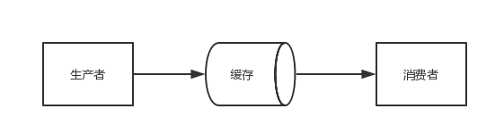

生成器
===

下面就以著名的生产者消费者模式来理解一下生成器。

----

```python
def consumer(name):
    print("要开始啃骨头了...")
    while True:
        print("\033[31;1m[consumer] %s\033[0m " % name)
        bone = yield
        print("[%s] 正在啃骨头 %s" % (name, bone))


def producer(obj1, obj2):
    obj1.send(None)    # 启动obj1这个生成器,第一次必须用None  <==> obj1.__next__()
    obj2.send(None)    # 启动obj2这个生成器,第一次必须用None  <==> obj2.__next__()
    n = 0
    while n < 5:
        n += 1
        print("\033[32;1m[producer]\033[0m 正在生产骨头 %s" % n)
        obj1.send(n)
        obj2.send(n)


if __name__ == '__main__':
    con1 = consumer("消费者A")
    con2 = consumer("消费者B")
    producer(con1, con2)

```

```python
要开始啃骨头了...
[consumer] 消费者A 
要开始啃骨头了...
[consumer] 消费者B 
[producer] 正在生产骨头 1
[消费者A] 正在啃骨头 1
[consumer] 消费者A 
[消费者B] 正在啃骨头 1
[consumer] 消费者B 
[producer] 正在生产骨头 2
[消费者A] 正在啃骨头 2
[consumer] 消费者A 
[消费者B] 正在啃骨头 2
[consumer] 消费者B 
[producer] 正在生产骨头 3
[消费者A] 正在啃骨头 3
[consumer] 消费者A 
[消费者B] 正在啃骨头 3
[consumer] 消费者B 
[producer] 正在生产骨头 4
[消费者A] 正在啃骨头 4
[consumer] 消费者A 
[消费者B] 正在啃骨头 4
[consumer] 消费者B 
[producer] 正在生产骨头 5
[消费者A] 正在啃骨头 5
[consumer] 消费者A 
[消费者B] 正在啃骨头 5
[consumer] 消费者B 
```
---
那么什么是生产者消费者模式？
===

在软件开发的过程中，经常碰到这样的场景：
某些模块负责生产数据，这些数据由其他模块来负责处理（此处的模块可能是：函数、线程、进程等）。产生数据的模块称为生产者，而处理数据的模块称为消费者。在生产者与消费者之间的缓冲区称之为仓库。生产者负责往仓库运输商品，而消费者负责从仓库里取出商品，这就构成了生产者消费者模式。

结构图如下：


为了大家容易理解，我们举一个寄信的例子。假设你要寄一封信，大致过程如下：
1. 你把信写好——相当于生产者生产数据
2. 你把信放入邮箱——相当于生产者把数据放入缓冲区
3. 邮递员把信从邮箱取出，做相应处理——相当于消费者把数据取出缓冲区，处理数据

生产者消费者模式的优点:

**解耦**

假设生产者和消费者分别是两个线程。如果让生产者直接调用消费者的某个方法，那么生产者对于消费者就会产生依赖（也就是耦合）。如果未来消费者的代码发生变化，可能会影响到生产者的代码。而如果两者都依赖于某个缓冲区，两者之间不直接依赖，耦合也就相应降低了。

举个例子，我们去邮局投递信件，如果不使用邮箱（也就是缓冲区），你必须得把信直接交给邮递员。有同学会说，直接给邮递员不是挺简单的嘛？其实不简单，你必须 得认识谁是邮递员，才能把信给他。这就产生了你和邮递员之间的依赖（相当于生产者和消费者的强耦合）。万一哪天邮递员 换人了，你还要重新认识一下（相当于消费者变化导致修改生产者代码）。而邮箱相对来说比较固定，你依赖它的成本就比较低（相当于和缓冲区之间的弱耦合）。

**并发**

由于生产者与消费者是两个独立的并发体，他们之间是用缓冲区通信的，生产者只需要往缓冲区里丢数据，就可以继续生产下一个数据，而消费者只需要从缓冲区拿数据即可，这样就不会因为彼此的处理速度而发生阻塞。

继续上面的例子，如果我们不使用邮箱，就得在邮局等邮递员，直到他回来，把信件交给他，这期间我们啥事儿都不能干（也就是生产者阻塞）。或者邮递员得挨家挨户问，谁要寄信（相当于消费者轮询）。

**支持忙闲不均**

当生产者制造数据快的时候，消费者来不及处理，未处理的数据可以暂时存在缓冲区中，慢慢处理掉。而不至于因为消费者的性能造成数据丢失或影响生产者生产。

们再拿寄信的例子，假设邮递员一次只能带走1000封信，万一碰上情人节（或是圣诞节）送贺卡，需要寄出去的信超过了1000封，这时候邮箱这个缓冲区就派上用场了。邮递员把来不及带走的信暂存在邮箱中，等下次过来时再拿走

---

yield已经成为Python最强大的关键字之一。

* generator是用来产生一系列值的
* yield则像是generator函数的返回结果
* yield唯一所做的另一件事就是保存一个generator函数的状态
* generator就是一个特殊类型的迭代器（iterator）
* 和迭代器相似，我们可以通过使用next()来从generator中获取下一个值
* 通过隐式地调用next()来忽略一些值